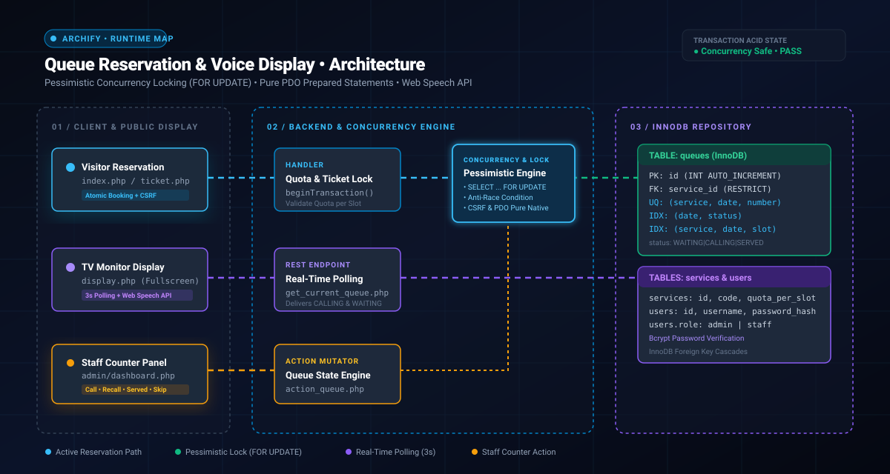

<div align="center">

# 🎫 Smart Service Queue & Time Slot Reservation System
### PHP 8.x Native (Pure PDO) • MySQL InnoDB ACID • Web Speech API

[](https://php.net)
[](https://mysql.com)
[](#-concurrency-control--race-condition-defense)
[](#3--real-time-tv-display--voice-synthesizer)
[](LICENSE)

<p align="center">
  A high-reliability, transaction-safe queue booking and real-time public calling system with pessimistic database locking (<code>SELECT ... FOR UPDATE</code>), pure PDO prepared statements, automated CSRF defenses, thermal print ticket styling, and Indonesian voice announcements.
</p>

</div>

---

## 🏛️ Live Runtime Architecture Map

<!-- ARCHIFY ANIMATED RUNTIME MAP -->
<div align="center">
  
</div>

<br>

| 🔒 Concurrency: Pessimistic Lock | 📢 Live Stream: TV & Voice API | 🎛️ Operator: Staff Counter |
| :--- | :--- | :--- |
| **Anti-Race Condition Kuota Slot**<br>Memanfaatkan `SELECT ... FOR UPDATE` dalam transaksi atomik untuk mengunci kuota slot dan nomor urut harian agar terhindar dari nomor duplikat saat trafik tinggi. | **Voice Synthesizer Otomatis**<br>Display TV publik memantau endpoint JSON setiap 3 detik dan melafalkan panggilan suara (*"Nomor antrean A-001, silakan menuju loket 1"*) via Web Speech API. | **Workspace Petugas Loket**<br>Panel terproteksi sesi untuk memanggil antrean berikutnya, panggilan ulang (*recall*), tandai selesai (*served*), atau lewati pengunjung (*skip*). |

---

## ⚡ Concurrency Control & Race Condition Defense

Dalam skenario reservasi antrean dengan kuota terbatas, pengiriman request secara bersamaan dapat menyebabkan kondisi *race condition* (over-quota). Sistem ini menerapkan **Pessimistic Locking**:

```text
[ Incoming Reservation ]
          │
          ▼
$pdo->beginTransaction();
          │
          ├─► 1. SELECT * FROM services WHERE id = ? FOR UPDATE;
          ├─► 2. SELECT COUNT(*) FROM queues WHERE ... FOR UPDATE;
          │      └─► [ Validasi Kuota: current_count < quota_per_slot ]
          ├─► 3. SELECT COALESCE(MAX(queue_number), 0) + 1 FROM queues ... FOR UPDATE;
          │      └─► [ Kunci & Ambil Nomor Urut Harian Berikutnya ]
          ├─► 4. INSERT INTO queues (...) VALUES (...);
          │
$pdo->commit();  ──► [ Kunci Baris Database Dilepas ]
```

---

## ✨ Key Features & Security Implementation

### 1. 🛡️ Concurrency & Integrity Locking
* **Pessimistic Row-Level Locking:** Mencegah pemesanan melebihi kuota (*over-booking*) dan duplikasi nomor urut harian menggunakan klausa `FOR UPDATE` di dalam blok `beginTransaction()` dan `commit()`.
* **Database Unique Constraints:** Skema tabel `queues` diproteksi indeks unik majemuk `uq_service_date_number (service_id, appointment_date, queue_number)` untuk menjamin integritas data pada tingkat database engine InnoDB.

### 2. 🔒 Defensive Programming & Hardening
* **Pure PDO Native Prepared Statements:** Opsi `PDO::ATTR_EMULATE_PREPARES => false` diaktifkan secara wajib agar query diproses murni melalui protokol biner MySQL untuk eliminasi celah SQL Injection.
* **CSRF Token Validation:** Verifikasi token kriptografis acak 32-byte (`random_bytes(32)`) pada setiap mutasi data menggunakan perbandingan konstan `hash_equals()`.
* **Output Escaping (XSS Defense):** Fungsi helper global `e()` yang menerapkan `htmlspecialchars(..., ENT_QUOTES | ENT_SUBSTITUTE, 'UTF-8')` pada seluruh data dinamis sebelum dicetak ke browser.
* **Hardened Session Management:** Konfigurasi cookie sesi dengan flag `HttpOnly`, `SameSite=Lax`, serta regenerasi ID sesi otomatis (`session_regenerate_id(true)`) saat login guna menangkal serangan *Session Fixation*.
* **Bcrypt Password Hashing:** Pengelolaan kredensial petugas menggunakan `password_hash()` dan `password_verify()` dengan algoritma Bcrypt standar industri.

### 3. 📺 Real-Time TV Display & Voice Synthesizer
* **Asynchronous Polling (3 Detik):** Layar display publik (`display.php`) memperbarui status panggilan loket dan daftar antrean menunggu via endpoint JSON `api/get_current_queue.php`.
* **Web Speech API:** Pemanggilan nomor antrean secara otomatis dalam audio bahasa Indonesia menggunakan `window.speechSynthesis` tanpa memerlukan file audio rekaman eksternal.

### 4. 🖨️ Thermal-Print Friendly Ticket
* Halaman `ticket.php` didesain dengan format struk termal yang rapi dan dilengkapi styling CSS `@media print` untuk mencetak nomor antrean tanpa elemen navigasi browser.

---

## 📁 File Structure

```text
antrean-app/
├── assets/
│   └── architecture.svg          # Diagram arsitektur interaktif beranimasi
├── config/
│   └── database.php              # Koneksi PDO murni, UTF8MB4, & Exception Handling
├── helpers/
│   └── functions.php             # Sanitasi XSS e(), generator CSRF, session, & format tanggal
├── api/
│   └── get_current_queue.php     # Endpoint REST API JSON untuk polling display TV
├── admin/
│   ├── login.php                 # Autentikasi petugas dengan proteksi brute force
│   ├── dashboard.php             # Workspace pemanggil antrean & metrik statistik loket
│   ├── action_queue.php          # Backend mutator status antrean (Call, Served, Skip, Recall)
│   └── logout.php                # Pemusnahan sesi dan penghapusan session cookie
├── schema.sql                    # Skema database MySQL InnoDB, relasi FK, & seed data
├── index.php                     # Halaman publik reservasi slot & pendaftaran antrean
├── ticket.php                    # Lembar bukti cetak nomor antrean pengunjung
├── display.php                   # Layar monitor TV publik ruang tunggu & audio speech
└── README.md                     # Dokumentasi komprehensif proyek
```

---

## 🛠️ Tech Stack & Requirements

* **Backend:** PHP 8.0+ (PDO MySQL Extension)
* **Database:** MySQL 8.0+ / MariaDB 10.4+ (InnoDB Engine)
* **Frontend:** Vanilla JavaScript (ES6+ Fetch API, Web Speech API), HTML5, CSS3 Media Print
* **Web Server:** Apache / Nginx / PHP Built-in Server

---

## 🚀 Quick Setup & Installation

1. **Clone Repositori:**
   ```bash
   git clone https://github.com/lilabshor/antrean-app.git
   cd antrean-app
   ```

2. **Setup Database:**
   * Buat database baru bernama `db_antrean` di MySQL / phpMyAdmin.
   * Impor file `schema.sql`:
     ```bash
     mysql -u root -p db_antrean < schema.sql
     ```

3. **Konfigurasi Database (`config/database.php`):**
   Sesuaikan kredensial server database lokal Anda:
   ```php
   $db_host = '127.0.0.1';
   $db_name = 'db_antrean';
   $db_user = 'root';
   $db_pass = ''; // Sesuaikan jika ada password
   ```

4. **Jalankan Aplikasi:**
   Jalankan server lokal PHP:
   ```bash
   php -S 127.0.0.1:8000
   ```

5. **Akses URL & Kredensial Default:**
   * **Formulir Registrasi Publik:** `[http://127.0.0.1:8000/index.php](http://127.0.0.1:8000/index.php)`
   * **Layar Display TV Ruang Tunggu:** `[http://127.0.0.1:8000/display.php](http://127.0.0.1:8000/display.php)`
   * **Portal Petugas / Admin:** `[http://127.0.0.1:8000/admin/login.php](http://127.0.0.1:8000/admin/login.php)`

   | Role | Username | Password Default | Akses / Loket |
   | :--- | :--- | :--- | :--- |
   | **Staff Loket 1** | `staff_loket1` | `password` | Panel Operator Loket 1 |
   | **Staff Loket 2** | `staff_loket2` | `password` | Panel Operator Loket 2 |
   | **Administrator** | `admin` | `password` | Akses Kontrol Penuh |

---

## 📄 License
This project is open-source and distributed under the [MIT License](LICENSE).
